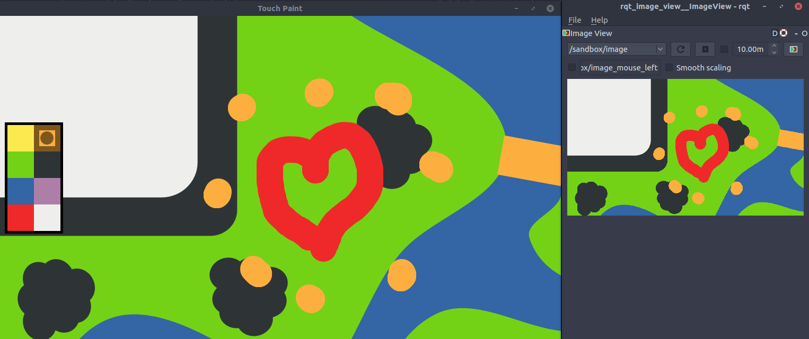

A 'Paint' application for ROS
=============================

A small Qt/QML-based application to draw (multi-touch supported) and publish the
resulting drawings as ROS images.

Pre-requisites
--------------

The drawing application depends on a ROS-QML extension: [ROS plugin for
QtQuick](https://github.com/severin-lemaignan/ros-qml-plugin).

Install it first.

